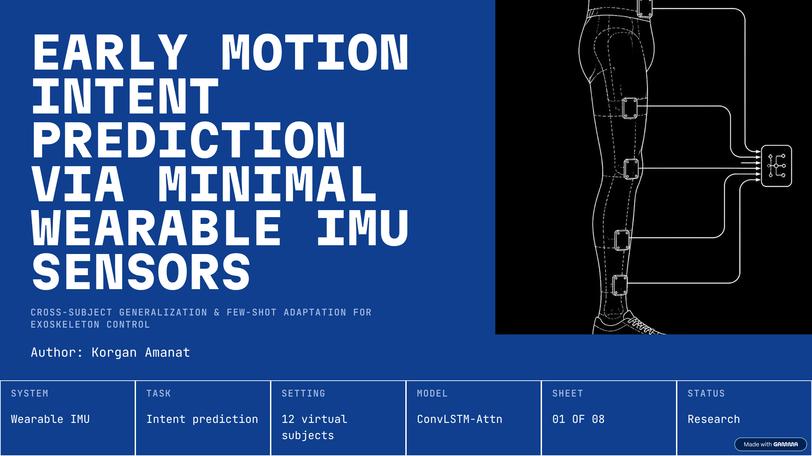
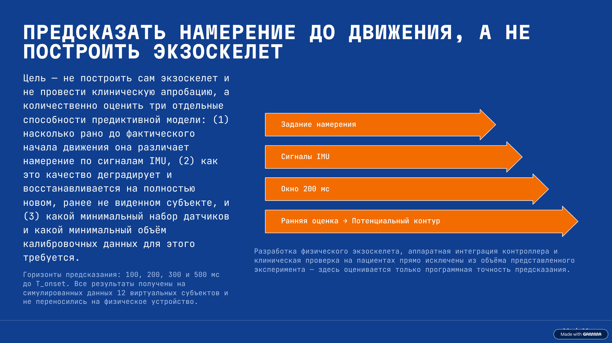
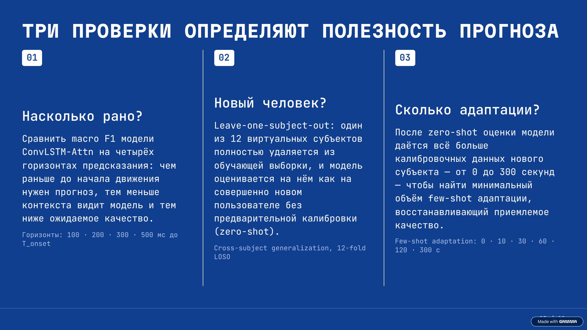
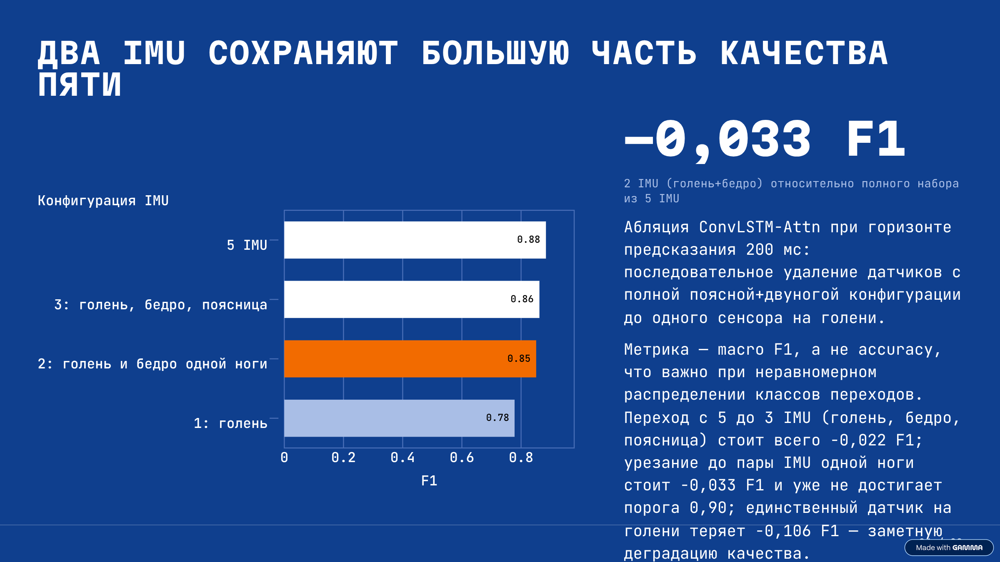
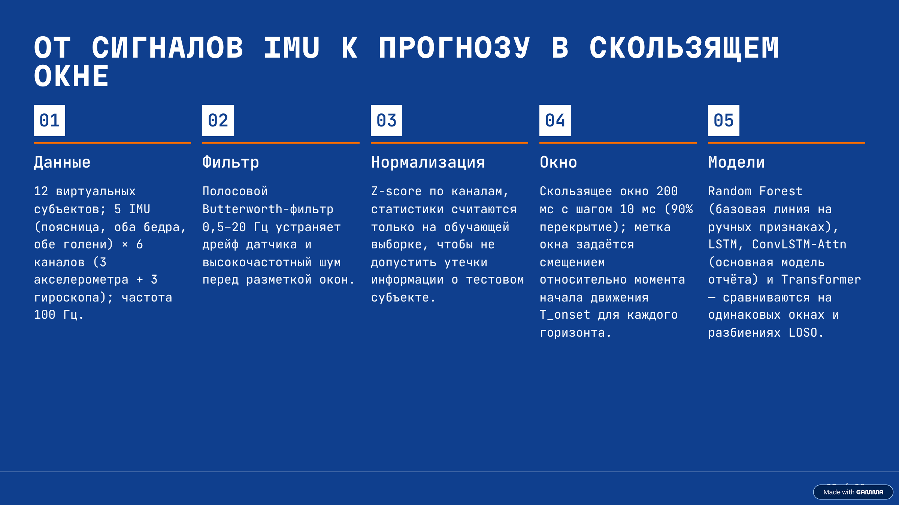
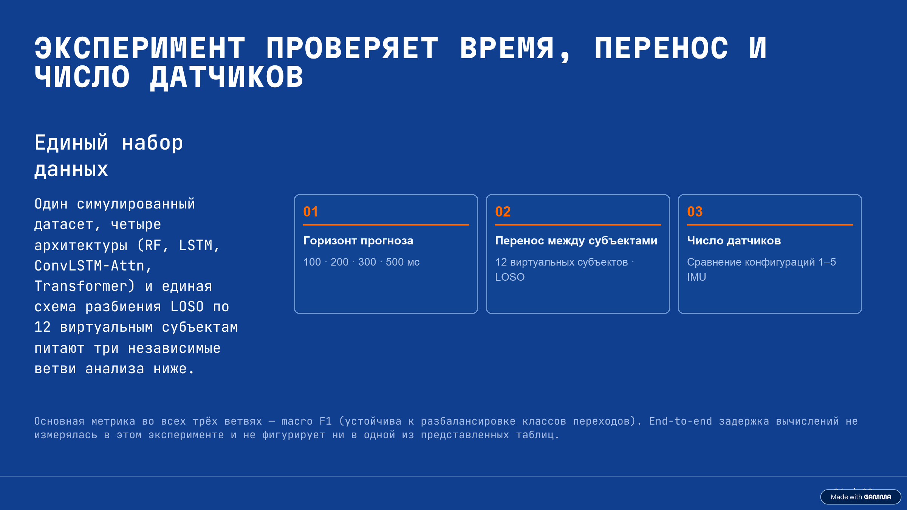
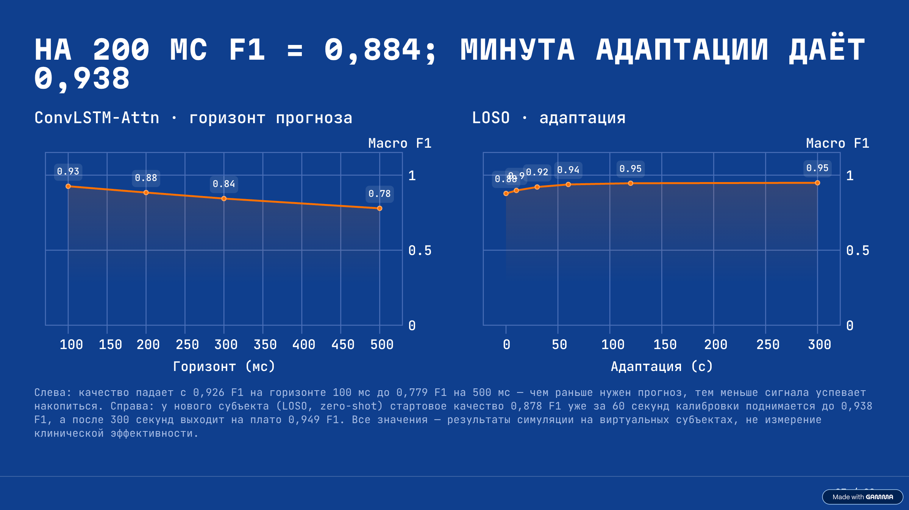
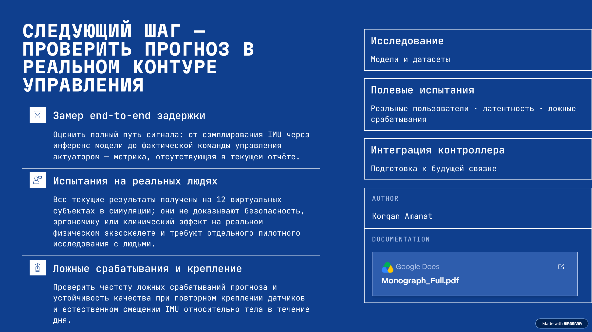

<div align="center">

# Раннее прогнозирование двигательных намерений человека

### Минимальные носимые IMU‑датчики для адаптивного экзоскелета нижних конечностей

Исследовательский проект о том, как распознавать намерение начать движение до его полного выполнения — по сигналам инерциальных датчиков и с учётом различий между пользователями.

[📄 Полная монография (PDF)](https://drive.google.com/file/d/1H6S0WTeTOPKSrNXUZ-H9zbas9I5VvW2L/view?usp=sharing) · [🖥️ Презентация ниже](#презентация) · [🧪 Код экспериментов](code/)


</div>

---

## О проекте

Экзоскелету важно не только распознать выполняемое движение, но и заранее оценить намерение пользователя. В проекте рассматриваются три практических вопроса: насколько далеко вперёд можно прогнозировать движение, как модель переносится на нового человека и сколько IMU‑датчиков достаточно для полезного прогноза.

В программном прототипе рассматриваются модели Random Forest, LSTM, ConvLSTM с attention и Transformer, скользящие окна IMU, оценка macro F1, схема Leave‑One‑Subject‑Out (LOSO), адаптация с малым числом примеров и сравнение конфигураций датчиков.

> **О статусе результатов.** Числа и графики в презентации относятся к симуляционному прототипу и виртуальным субъектам. Они не являются результатами клинического исследования или испытаний на реальных пользователях и требуют проверки на собранных данных и физическом устройстве.

## Презентация

Слайды идут по порядку; нажмите на изображение, чтобы открыть его в полном размере.

### 01 · Раннее прогнозирование намерения движения

[](slides/slide-01.png)

### 02 · Прогнозировать намерение, а не строить экзоскелет

[](slides/slide-02.png)

### 03 · Три проверки полезности прогноза

[](slides/slide-03.png)

### 04 · Сравнение конфигураций IMU по macro F1

[](slides/slide-04.png)

### 05 · От сигналов IMU к прогнозу в скользящем окне

[](slides/slide-05.png)

### 06 · План экспериментальной оценки

[](slides/slide-06.png)

### 07 · Few-shot адаптация: иллюстративные результаты симуляции

[](slides/slide-07.png)

### 08 · Следующий шаг: проверка в реальном контуре управления

[](slides/slide-08.png)

## Материалы

- **[Полная монография в PDF на Google Drive](https://drive.google.com/file/d/1H6S0WTeTOPKSrNXUZ-H9zbas9I5VvW2L/view?usp=sharing)**
- [Исходник монографии в Markdown](Monograph_Full.md)
- [PDF в репозитории](Monograph_Full.pdf)
- [Исходный код и зависимости](code/)

## Структура репозитория

```text
.
├── README.md                 # Описание проекта и слайды
├── Monograph_Full.md         # Исходник монографии
├── Monograph_Full.pdf        # PDF монографии
├── slides/                   # Восемь изображений презентации
├── code/
│   ├── data_generator.py     # Генерация симулированных сигналов
│   ├── preprocessing.py      # Обработка сигналов
│   ├── models.py             # Модели машинного обучения
│   ├── training.py           # Обучение
│   ├── run_experiments.py    # Запуск демонстрационных экспериментов
│   └── requirements.txt
└── sections/                 # Главы монографии
```

## Запуск демонстрационного эксперимента

Требуется Python 3.10 или новее.

```bash
cd code
python -m venv .venv
source .venv/bin/activate  # Windows: .venv\Scripts\activate
pip install -r requirements.txt
python run_experiments.py
```

Скрипт формирует демонстрационные результаты в `code/results/`. Он использует симулированные значения; для научной оценки модели необходимо обучить и проверить на реальных размеченных данных.

---

<div align="center">

**Автор:** Korgan Amanat · Исследование, код и презентация — в одном репозитории.

</div>
