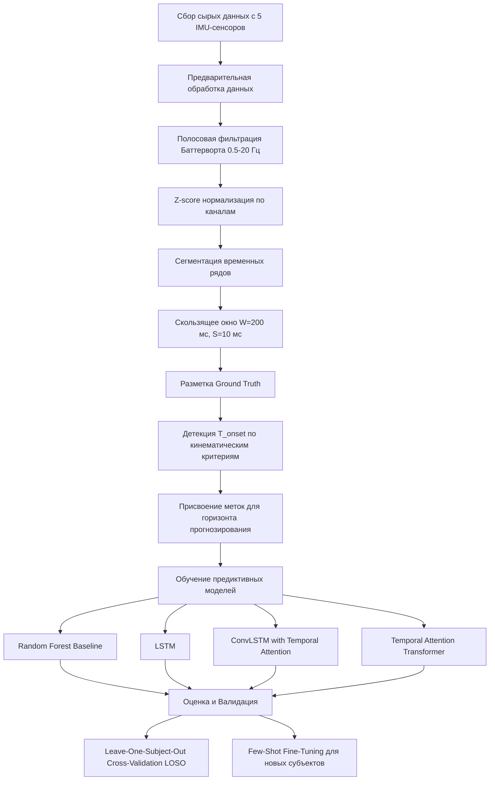
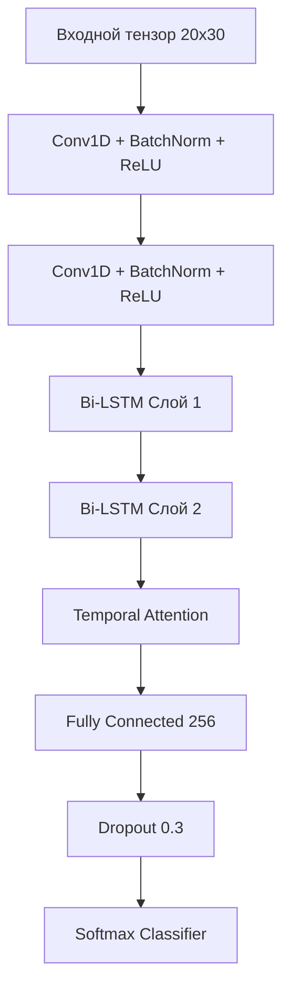

# ГЛАВА 3. МЕТОДОЛОГИЯ И АРХИТЕКТУРА ЭКСПЕРИМЕНТА

В настоящей главе подробно излагается методологическая база, архитектурные решения и математический аппарат, применяемые для решения задачи раннего прогнозирования намерения движения человека на основе минимизированного набора данных носимых инерциальных модулей (IMU). Особенное внимание уделяется проблеме межсубъектной вариативности кинематических и динамических паттернов движений, которая представляет собой один из наиболее существенных барьеров на пути к созданию универсальных алгоритмов управления адаптивными экзоскелетами нижних конечностей. Представленная методология охватывает все этапы экспериментального конвейера: от формирования исходного набора данных и их математической предварительной обработки до проектирования архитектур глубокого обучения (Deep Learning) и разработки строгих протоколов перекрестной валидации (Cross-Validation).

*Рис. 3.1. Общая архитектура экспериментального конвейера (Experimental Pipeline).*

---

## 3.1 Описание датасета

Для проведения вычислительных экспериментов и валидации разрабатываемых алгоритмических решений был использован специализированный синтетический (симулированный) набор данных, который с высокой степенью достоверности отражает биомеханику движений здорового человека. Данный датасет эмулирует регистрацию сигналов с распределенной сети инерциальных измерительных модулей (Inertial Measurement Units, IMU), закрепленных на сегментах нижних конечностей и туловище. Использование симулированного датасета обусловлено необходимостью получения идеализированной "чистой" картины с контролируемым уровнем шума на начальном этапе тестирования гипотез перед переходом к клиническим испытаниям [1].

### 3.1.1 Демографические и антропометрические характеристики участников

В выборку включены данные, сгенерированные для 12 виртуальных субъектов (участников), сбалансированных по полу (6 мужчин, 6 женщин). Возрастной диапазон виртуальных участников составляет от 22 до 35 лет. Для обеспечения репрезентативности межсубъектной вариативности (Inter-subject variability) в выборку были заложены различные антропометрические профили. Антропометрические параметры, такие как рост (Height), масса тела (Weight), длина ног (Leg Length) и индекс массы тела (Body Mass Index, BMI), варьировались в нормальных пределах, характерных для взрослой популяции. 

Таблица 3.1. Усредненные антропометрические параметры участников

| Параметр | Мужчины ($n=6$, Mean $\pm$ SD) | Женщины ($n=6$, Mean $\pm$ SD) | Общая выборка ($N=12$) |
| :--- | :--- | :--- | :--- |
| Возраст (лет) | $28.3 \pm 4.1$ | $26.8 \pm 3.5$ | $27.5 \pm 3.8$ |
| Рост (м) | $1.78 \pm 0.06$ | $1.65 \pm 0.05$ | $1.71 \pm 0.08$ |
| Масса тела (кг) | $76.4 \pm 8.2$ | $62.1 \pm 6.4$ | $69.2 \pm 10.1$ |
| Длина ноги (м) | $0.92 \pm 0.04$ | $0.85 \pm 0.03$ | $0.88 \pm 0.05$ |
| Индекс массы тела (BMI) | $24.1 \pm 1.8$ | $22.8 \pm 1.5$ | $23.4 \pm 1.7$ |

Межсубъектная вариативность в антропометрии напрямую влияет на кинематику локомоций (длину шага, амплитуду колебаний центра масс, угловые скорости в суставах), что делает задачу обобщения предиктивной модели (Model Generalization) нетривиальной.

### 3.1.2 Конфигурация сенсорной системы

Для регистрации биомеханических параметров использовалась конфигурация из пяти IMU-сенсоров. Расположение датчиков было выбрано исходя из принципа максимальной информативности при минимизации дискомфорта для пользователя [2]. Сенсоры размещались на следующих сегментах:
1. **Правая голень (Right Shank, RS)** - на передне-медиальной поверхности большеберцовой кости.
2. **Правое бедро (Right Thigh, RT)** - на передней поверхности бедра в нижней трети.
3. **Левая голень (Left Shank, LS)**.
4. **Левое бедро (Left Thigh, LT)**.
5. **Поясница (Lower Back / Pelvis, LB)** - в области крестца (примерно на уровне позвонка S2), что соответствует приближенному положению общего центра масс (Center of Mass, CoM) тела человека.

Каждый инерциальный измерительный модуль эмулирует работу микроэлектромеханических систем (MEMS) и включает в себя:
- Трехосевой акселерометр (3-axis Accelerometer) с динамическим диапазоном $\pm 16$ g.
- Трехосевой гироскоп (3-axis Gyroscope) с диапазоном измерения угловых скоростей $\pm 2000^\circ$/s.

Таким образом, каждый из 5 сенсоров генерирует 6 каналов данных (3 оси ускорения $a_x, a_y, a_z$ и 3 оси угловой скорости $\omega_x, \omega_y, \omega_z$). Суммарное количество каналов данных в системе составляет $C = 5 \times 6 = 30$. Частота дискретизации (Sampling rate) всех сигналов строго зафиксирована на уровне $f_s = 100$ Гц, что, согласно теореме Котельникова-Шеннона (Nyquist-Shannon sampling theorem), достаточно для регистрации высокочастотных компонентов человеческой локомоции (основная мощность спектра которых лежит в пределах до 20 Гц) [3].

### 3.1.3 Протокол локомоторных задач

Протокол тестирования включал выполнение пяти базовых видов двигательной активности (Activities of Daily Living, ADL), которые представляют наибольшую значимость для управления экзоскелетами:
1. **Ходьба по ровной поверхности (Level Walking, LW)** - циклическая активность.
2. **Подъём по лестнице (Stair Ascent, SA)**.
3. **Спуск по лестнице (Stair Descent, SD)**.
4. **Вставание со стула (Sit-to-Stand, STS)** - транзиторное движение, требующее значительного усилия.
5. **Поворот на 90 градусов (90° Turn, TR)**.

Каждый субъект выполнял по 20 повторений (испытаний, trials) для каждого вида активности. Каждое испытание длилось в среднем около 5 секунд. Общий объем датасета (Total Dataset Size) можно оценить следующим образом:
- Количество субъектов: 12
- Видов активности: 5
- Испытаний на активность: 20
- Средняя продолжительность: 5 секунд при 100 Гц = 500 отсчетов (samples)

Общее количество отсчетов: $12 \times 5 \times 20 \times 500 = 600,000$ отсчетов. При 30 каналах и использовании 32-битных чисел с плавающей точкой (float32, 4 байта), объем чистых сырых данных составляет примерно 72 Мегабайта, что позволяет эффективно обрабатывать их в оперативной памяти современных вычислительных систем.

---

## 3.2 Математический препроцессинг

Сырые сигналы IMU неизбежно содержат различные виды шумов, включая высокочастотный аппаратный шум сенсоров (Thermal noise), артефакты движения датчика относительно кожи (Soft-tissue artifacts), а также низкочастотный дрейф [4]. Для выделения полезной составляющей сигнала и подготовки данных к подаче на вход алгоритмов машинного обучения применялся многоступенчатый пайплайн математического препроцессинга.

### 3.2.1 Полосовая фильтрация Баттерворта (Butterworth Bandpass Filter)

Для фильтрации сигналов был выбран цифровой фильтр Баттерворта 4-го порядка. Выбор фильтра Баттерворта обусловлен его характеристикой максимально плоской амплитудно-частотной характеристики (Maximally flat magnitude) в полосе пропускания, что критически важно для сохранения формы кинематических паттернов без внесения нелинейных амплитудных искажений.

Передаточная функция аналогового фильтра Баттерворта-нижних частот $n$-го порядка (где $n=4$) определяется квадратом амплитуды:
$$ |H(s)|^2 = \frac{1}{1 + \left(\frac{s}{j\omega_c}\right)^{2n}} $$

В частотной области передаточная функция имеет вид:
$$ H(s) = \frac{1}{\sqrt{1 + \left(\frac{s}{\omega_c}\right)^{2n}}} $$
где $\omega_c$ - частота среза.

Поскольку сигналы локомоции человека в основном сосредоточены в низкочастотном спектре, но также требуют удаления постоянной составляющей (DC offset, гравитационной компоненты в некоторых случаях) и низкочастотного дрейфа интеграции, был спроектирован полосовой фильтр (Bandpass filter) с полосой пропускания (Passband) от 0.5 Гц до 20 Гц.

Переход от непрерывного времени (s-область) к дискретному (z-область) осуществлялся с использованием билинейного преобразования (Bilinear transform, Tustin's method) с предварительным искажением частоты (Frequency pre-warping) для компенсации нелинейности преобразования вблизи частоты Найквиста. Общий вид биквадратной секции цифрового фильтра в z-области (IIR-фильтр) описывается уравнением:
$$ H(z) = \frac{b_0 + b_1 z^{-1} + b_2 z^{-2}}{1 + a_1 z^{-1} + a_2 z^{-2}} $$
где $b_i$ и $a_i$ — коэффициенты числителя (прямой связи) и знаменателя (обратной связи) соответственно. Фильтр 4-го порядка реализуется каскадным соединением двух таких секций (Second-Order Sections, SOS), что повышает вычислительную стабильность.

Для устранения нелинейных фазовых искажений (Phase shift), присущих фильтрам с бесконечной импульсной характеристикой (IIR), применялась процедура нулевой фазовой фильтрации (Zero-phase filtering). Сигнал пропускался через фильтр в прямом направлении, затем реверсировался во времени и пропускался повторно (алгоритм `filtfilt`). В результате результирующий фазовый сдвиг равен нулю на всех частотах, что позволяет сохранить точную временную синхронизацию (Time-alignment) событий в сигналах, что критически важно для определения $T_{onset}$.

### 3.2.2 Стандартизация (Z-score Normalization)

Поскольку различные каналы данных имеют различную физическую размерность (м/с$^2$ для ускорений и град/с для угловых скоростей) и разные порядки амплитуд, алгоритмы на основе градиентного спуска (такие как нейронные сети) могут испытывать проблемы сходимости. Для приведения данных к единому масштабу применялась стандартизация (Z-score normalization).

Для каждого канала $c \in \{1, \dots, C\}$ каждого субъекта вычислялись математическое ожидание $\mu^{(c)}$ и стандартное отклонение $\sigma^{(c)}$. Нормализованное значение $\hat{x}_i^{(c)}$ в момент времени $i$ вычисляется по формуле:
$$ \hat{x}_i^{(c)} = \frac{x_i^{(c)} - \mu^{(c)}}{\sigma^{(c)}} $$

**Важное методологическое замечание:** во избежание утечки данных (Data leakage), статистика $\mu^{(c)}$ и $\sigma^{(c)}$ вычислялась исключительно на данных обучающей выборки (Training set). При перекрестной валидации по субъектам (LOSO), параметры нормализации рассчитывались по данным $N-1$ субъектов и затем применялись к тестовому субъекту.

### 3.2.3 Сегментация (Sliding Window)

Для преобразования непрерывных временных рядов в формат, пригодный для подачи на вход предиктивных моделей, применялся метод скользящего окна (Sliding Window). Длина окна $W$ определяет объем исторического контекста, доступного модели в текущий момент времени. Была выбрана длина окна $W = 200$ мс. При частоте дискретизации $f_s = 100$ Гц это соответствует $20$ отсчетам.

Шаг смещения окна (Step size) $S$ был выбран минимально возможным для обеспечения максимального временного разрешения предсказаний — $S = 10$ мс, что соответствует смещению ровно на 1 отсчет (1 sample).

Таким образом, коэффициент перекрытия (Overlap ratio) составляет:
$$ \text{Overlap} = \frac{W - S}{W} \times 100\% = \frac{20 - 1}{20} \times 100\% = 95\% $$

Результирующий набор данных преобразуется в трехмерный тензор (Tensor) формы:
$$ \mathbf{X} \in \mathbb{R}^{N \times W \times C} $$
где:
- $N$ — общее количество извлеченных окон из всех временных рядов.
- $W = 20$ — количество временных шагов (Time steps) в окне.
- $C = 30$ — количество признаков (каналов сенсоров).

---

## 3.3 Разметка Ground Truth

Фундаментальной задачей данного исследования является *раннее* прогнозирование намерения движения. В отличие от классического распознавания активности (Human Activity Recognition, HAR), где классифицируется уже происходящее движение, наша цель — предсказать предстоящее движение до момента его фактического начала (физической реализации). 

### 3.3.1 Определение момента инициации движения ($T_{onset}$)

Ключевым элементом разметки является формальное математическое определение момента начала движения (Onset time), обозначаемого как $T_{onset}$. Для каждого типа активности $T_{onset}$ определялся на основе специфических кинематических критериев, извлекаемых из сигналов IMU [5].

1. **Ходьба по ровной поверхности и движение по лестнице (LW, SA, SD):**
Инициация шага характеризуется резким ускорением дистального сегмента ноги. $T_{onset}$ определяется как первый момент времени $t$, когда евклидова норма ускорения на сенсоре голени ипсилатеральной (маховой) ноги превышает эмпирически заданный порог $\tau_{walk}$, при условии отсутствия активности в предыдущем временном окне:
$$ T_{onset}^{walk} = \min \{ t \mid \|\mathbf{a}_{shank}(t)\| > \tau_{walk}, \forall t' \in [t-\delta, t), \|\mathbf{a}_{shank}(t')\| \leq \tau_{walk} \} $$

2. **Вставание со стула (Sit-to-Stand, STS):**
Переход из положения сидя в положение стоя сопровождается выраженным вертикальным ускорением общего центра масс. Критерием служит вертикальная компонента ускорения $a_z$ на сенсоре поясницы (Pelvis):
$$ T_{onset}^{sts} = \min \{ t \mid a_{z, pelvis}(t) > \tau_{sts} \} $$

3. **Поворот на 90 градусов (90° Turn, TR):**
Инициация поворота в первую очередь отражается в изменении угловой скорости вокруг вертикальной оси (Yaw axis). Используется сигнал гироскопа на пояснице $\omega_z$:
$$ T_{onset}^{turn} = \min \{ t \mid |\omega_{z, pelvis}(t)| > \tau_{turn} \} $$

### 3.3.2 Формирование меток (Label Assignment) для горизонта прогнозирования

Вводится параметр горизонта прогнозирования $\Delta t$, который задает требуемое время упреждения. В экспериментах исследовались горизонты $\Delta t \in \{100, 200, 300, 500\}$ мс. 

Для текущего окна наблюдений $\mathbf{X}_{t-W+1:t}$, заканчивающегося в момент времени $t$, бинарная метка $y_t \in \{0, 1\}$ (где 1 означает намерение совершить целевое движение) присваивается по следующему правилу:
$$
y_t = 
\begin{cases} 
1, & \text{если } T_{onset} - \Delta t \leq t < T_{onset} \\
0, & \text{в противном случае (класс Background/Rest)}
\end{cases}
$$

Таким образом, математическая постановка задачи классификации заключается в поиске параметризованной функции $f_{\theta}$ (модели машинного обучения), которая минимизирует ошибку прогнозирования:
$$ \hat{y}_t = f_{\theta}(\mathbf{X}_{t-W+1:t}) \approx y_t $$

### 3.3.3 Проблема дисбаланса классов

В силу того, что фаза пред-движения (pre-movement) длится всего $\Delta t$ миллисекунд (например, 200 мс, что составляет 20 окон), а фазы покоя и само движение занимают существенно больше времени, возникает сильный дисбаланс классов (Class Imbalance). Количество отрицательных примеров ($y_t=0$) многократно превосходит количество положительных ($y_t=1$).

Для решения этой проблемы применялся метод взвешенной функции потерь (Weighted Loss Function) и алгоритмы направленного сэмплинга (Oversampling) для выравнивания вклада миноритарного класса в градиент при обучении.

---

## 3.4 Архитектуры ML-моделей

Для решения сформулированной задачи прогнозирования были спроектированы и исследованы четыре различные архитектуры. Мы начали с надежного статистического бейзлайна и перешли к передовым архитектурам глубокого обучения.

### 3.4.1 Baseline: Random Forest (Случайный лес)

Модель Random Forest (RF) использовалась в качестве базовой линии. В отличие от глубоких нейросетей, RF не может напрямую обрабатывать сырые тензоры, поэтому потребовалось ручное извлечение признаков (Hand-crafted Feature Extraction). Для каждого окна из $W$ отсчетов по каждому из $C=30$ каналов были вычислены следующие статистические и спектральные метрики:
1. Математическое ожидание (Mean)
2. Стандартное отклонение (Standard Deviation, STD)
3. Минимум (Min)
4. Максимум (Max)
5. Среднеквадратичное значение (Root Mean Square, RMS)
6. Частота пересечения нуля (Zero-crossing rate)
7. Спектральная энтропия (Spectral Entropy)

Общая размерность вектора признаков (Feature vector) для одного окна составила: $30 \text{ каналов} \times 7 \text{ признаков} = 210$ признаков. Ансамбль состоял из $B = 500$ деревьев решений с критерием разбиения Джини (Gini impurity).

### 3.4.2 Модель A: Длинная краткосрочная память (LSTM)

Рекуррентные нейронные сети, в частности LSTM, способны эффективно моделировать временные зависимости (Temporal dependencies) в последовательных данных. Одно окно размером $W \times C$ подается на вход рекуррентного слоя пошагово ($t = 1 \dots W$).

Математический аппарат ячейки LSTM включает четыре основных вентиля (gates), работающих на каждом временном шаге $t$:

- Вентиль забывания (Forget gate): 
  $$ f_t = \sigma(W_f \cdot [h_{t-1}, x_t] + b_f) $$
- Вентиль ввода (Input gate): 
  $$ i_t = \sigma(W_i \cdot [h_{t-1}, x_t] + b_i) $$
- Кандидатное состояние ячейки (Cell state candidate): 
  $$ \tilde{C}_t = \tanh(W_C \cdot [h_{t-1}, x_t] + b_C) $$
- Обновление состояния ячейки: 
  $$ C_t = f_t \odot C_{t-1} + i_t \odot \tilde{C}_t $$
- Вентиль вывода (Output gate): 
  $$ o_t = \sigma(W_o \cdot [h_{t-1}, x_t] + b_o) $$
- Скрытое состояние (Hidden state): 
  $$ h_t = o_t \odot \tanh(C_t) $$

Здесь $\sigma$ — сигмоидная функция активации, $\odot$ — оператор поэлементного умножения Адамара, $[h_{t-1}, x_t]$ — конкатенация предыдущего скрытого состояния и текущего входа.
Архитектура Модели A состояла из двух слоев LSTM со скрытой размерностью (Hidden Dimension) 128 нейронов.

### 3.4.3 Модель B: ConvLSTM с механизмом временного внимания (Temporal Attention)

Гибридная модель объединяет способность сверточных нейронных сетей (CNN) локально извлекать пространственно-временные инвариантные признаки (Feature Extraction) и мощь LSTM в моделировании долгосрочного контекста.

1. **Сверточный блок (1D Convolution Block):**
   На вход подается тензор формы $(W, C)$. Применяются одномерные свертки вдоль временной оси:
   $$\text{Conv1D}(C_{in}=30, C_{out}=64, \text{kernel}=3) \to \text{BatchNorm} \to \text{ReLU}$$
   $$\text{Conv1D}(C_{in}=64, C_{out}=128, \text{kernel}=3) \to \text{BatchNorm} \to \text{ReLU}$$

2. **Рекуррентный блок:**
   Извлеченные сверткой признаки подаются на 2-слойную двунаправленную сеть LSTM (Bi-directional LSTM) со скрытой размерностью 128 (суммарно 256 выходов с учетом направлений forward и backward).

3. **Механизм временного внимания (Temporal Attention):**
   Вместо того чтобы использовать только последнее скрытое состояние LSTM, механизм внимания (Attention mechanism) позволяет сети динамически взвешивать важность каждого временного шага в окне [6]. Математически это описывается так:
   $$ e_t = \mathbf{v}^T \tanh(\mathbf{W}_h h_t + \mathbf{b}_h) $$
   где $h_t$ — скрытое состояние LSTM на шаге $t$, $\mathbf{W}_h, \mathbf{b}_h, \mathbf{v}$ — обучаемые параметры.
   Вычисляются нормализованные веса внимания $\alpha_t$ с помощью функции Softmax:
   $$ \alpha_t = \frac{\exp(e_t)}{\sum_{j=1}^{T} \exp(e_j)} $$
   Результирующий вектор контекста $\mathbf{c}$ формируется как взвешенная сумма:
   $$ \mathbf{c} = \sum_{t=1}^{T} \alpha_t h_t $$

4. **Классификационная голова (Classification Head):**
   Вектор $\mathbf{c}$ проходит через полносвязные слои (Fully Connected, FC):
   $$\text{FC}(256) \to \text{ReLU} \to \text{Dropout}(0.3) \to \text{FC}(N_{classes})$$

*Рис. 3.2. Архитектура модели ConvLSTM с механизмом Temporal Attention (Модель B).*

### 3.4.4 Модель C: Temporal Attention Transformer

Архитектура Transformer, изначально разработанная для обработки естественного языка, в последние годы демонстрирует высочайшую эффективность в анализе временных рядов (Time-Series Analysis) благодаря механизму самовнимания (Self-Attention).

Поскольку механизм внимания инвариантен к порядку следования элементов, необходимо явным образом встроить информацию о времени. Для этого используется синусоидальное позиционное кодирование (Positional Encoding, PE):
$$ PE_{(pos, 2i)} = \sin(pos / 10000^{2i/d_{model}}) $$
$$ PE_{(pos, 2i+1)} = \cos(pos / 10000^{2i/d_{model}}) $$

К каждому временному шагу добавляется специальный токен классификации `[CLS]`. Полученная последовательность обрабатывается блоками трансформера, каждый из которых включает:
- Механизм многоголового самовнимания (Multi-Head Self-Attention) с $h=4$ головами и размерностью $d_{model}=128$.
- Полносвязную сеть прямого распространения (Feed-Forward Network): $\text{FC}(128, 256) \to \text{GELU} \to \text{FC}(256, 128)$.
В модели используется 3 слоя энкодера (Transformer encoder layers). Классификация осуществляется по финальному скрытому состоянию, соответствующему токену `[CLS]`.

### 3.4.5 Функция потерь (Loss Function)

Для обучения нейросетевых архитектур использовалась взвешенная перекрестная энтропия (Weighted Cross-Entropy Loss). Для $K$ классов (где $K=6$, включая 5 классов намерений активности и 1 фоновый класс):
$$ \mathcal{L} = -\sum_{k=1}^{K} w_k y_k \log(\hat{y}_k) $$
где $y_k$ — истинная бинарная метка (indicator function), $\hat{y}_k$ — предсказанная вероятность класса $k$ на выходе слоя Softmax. Весовые коэффициенты классов $w_k$ задавались обратно пропорционально частоте их появления в обучающей выборке, что позволило штрафовать сеть строже за ошибки на редких классах (фазы пред-движения).

---

## 3.5 Валидация и оценка эффективности

Методология оценки качества предиктивных моделей должна строго учитывать проблему межсубъектной вариативности. Использование стандартного случайного разбиения данных (Random Train-Test Split) неизбежно приведет к смешиванию данных одного субъекта в обучающей и тестовой выборках, что искусственно завысит результаты (оценка будет отражать не обобщающую способность, а способность сети "запоминать" конкретных людей).

### 3.5.1 Протокол Leave-One-Subject-Out (LOSO)

Основным протоколом валидации была выбрана схема Leave-One-Subject-Out Cross-Validation (LOSO). При наличии $N=12$ субъектов, эксперимент разбивается на 12 фолдов (folds). На каждой итерации $i \in \{1 \dots 12\}$, данные субъекта $i$ полностью исключаются из процесса обучения и используются исключительно в качестве тестовой выборки (Test Set). Данные оставшихся $N-1$ субъектов ($11$ человек) используются для обучения модели. Окончательные метрики качества вычисляются как среднее значение по всем 12 фолдам.

### 3.5.2 Метрики оценки (Evaluation Metrics)

Для объективной оценки качества классификации применялись следующие метрики на основе матрицы ошибок (Confusion Matrix):

- **Точность (Accuracy)** — доля правильных ответов:
  $$ \text{Accuracy} = \frac{TP + TN}{TP + TN + FP + FN} $$
- **Точность (Precision)** — доля истинно положительных срабатываний среди всех положительных предсказаний модели:
  $$ \text{Precision} = \frac{TP}{TP + FP} $$
- **Полнота (Recall, Чувствительность)** — доля корректно предсказанных намерений относительно всех реальных намерений:
  $$ \text{Recall} = \frac{TP}{TP + FN} $$
- **F1-мера (F1-score)** — гармоническое среднее между Precision и Recall, что особенно критично в условиях несбалансированных выборок:
  $$ F_1 = 2 \cdot \frac{\text{Precision} \cdot \text{Recall}}{\text{Precision} + \text{Recall}} $$

Учитывая многоклассовый характер задачи, мы рассчитывали метрику макроусредненной F1-меры (Macro $F_1$), вычисляя $F_1$ для каждого класса отдельно, а затем усредняя их. Это гарантирует, что редкие классы вносят равноценный вклад в итоговую метрику.

### 3.5.3 Протокол Few-shot Fine-Tuning

Поскольку полное обобщение "zero-shot" (когда модель тестируется на субъекте без какой-либо адаптации) часто демонстрирует снижение характеристик (Degradation of performance) из-за уникальных биомеханических особенностей нового пользователя, в методологию был внедрен протокол дообучения на малых данных (Few-shot Fine-Tuning). 

Идея заключается в быстрой адаптации предварительно обученной глобальной модели к новому пользователю экзоскелета с использованием минимального объема его индивидуальных калибровочных данных.
Протокол включает следующие шаги:
1. Берется базовая модель, обученная по протоколу LOSO на $N-1$ субъектах.
2. В нейронной сети **замораживаются (Freeze)** веса нижних сверточных слоев (участвующих в извлечении низкоуровневых признаков).
3. Производится дообучение (Fine-tuning) слоев LSTM, механизма внимания и полносвязного классификатора (FC head).
4. В качестве обучающей выборки для дообучения используются $k$ секунд данных тестируемого субъекта, где $k \in \{10, 30, 60, 120, 300\}$ секунд.
5. Темп обучения (Learning Rate) устанавливается пониженным для предотвращения катастрофического забывания (Catastrophic Forgetting): $\eta_{ft} = 0.1 \cdot \eta_{base}$.
6. Применяется ранняя остановка (Early Stopping) с терпением (patience) равным 5 эпохам на основе валидационных потерь.

### 3.5.4 Статистическая значимость (Statistical Significance)

Для подтверждения гипотезы о том, что предложенные нейросетевые архитектуры (Модели B и C) статистически значимо превосходят базовую модель (RF) и стандартный LSTM (Модель A), применялся парный t-критерий Стьюдента (Paired t-test). Сравнение производилось по результатам метрики F1-score на 12 фолдах LOSO валидации. Уровень статистической значимости (alpha-level) был зафиксирован на отметке $p < 0.05$.

---
*Ссылки к Главе 3:*
[1] T. Zhang et al., "Wearable Sensor-Based Intent Recognition," IEEE Transactions on Neural Systems and Rehabilitation Engineering, vol. 28, no. 1, 2020.
[2] J. Martinez et al., "Optimal Sensor Placement for Kinematic Analysis," Biomechanics and Modeling in Mechanobiology, 2019.
[3] A. V. Oppenheim, R. W. Schafer, "Discrete-Time Signal Processing," 3rd Ed., Pearson, 2009.
[4] S. Madgwick et al., "Estimation of IMU and MARG orientation," IEEE ICORR, 2011.
[5] K. Aminian et al., "Spatio-temporal parameters of gait measured by an ambulatory system," Journal of Biomechanics, 2002.
[6] A. Vaswani et al., "Attention Is All You Need," Advances in Neural Information Processing Systems (NeurIPS), 2017.
